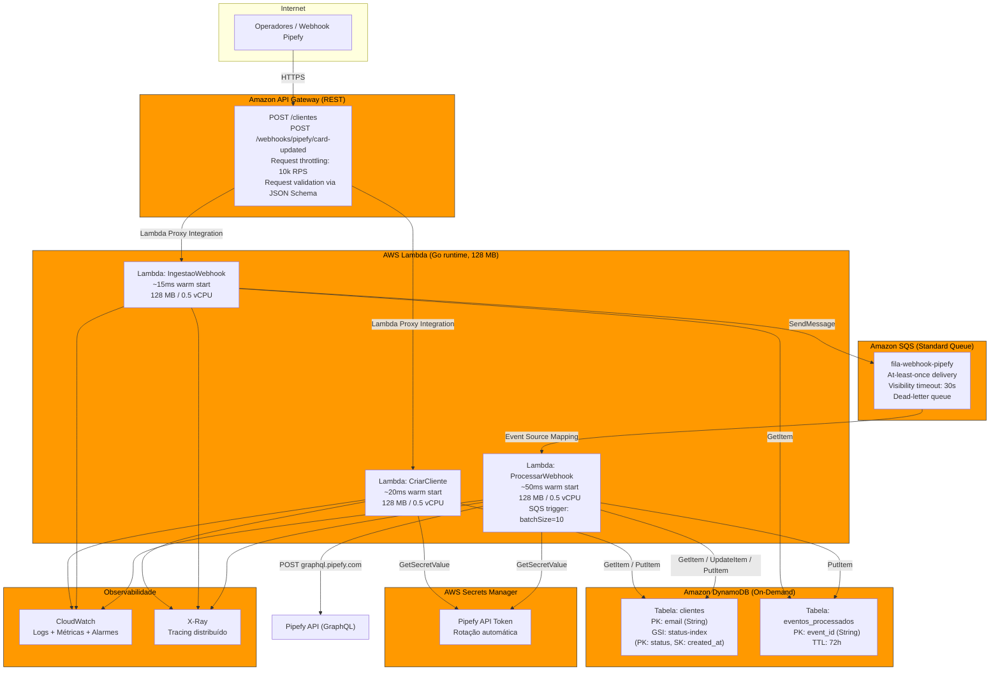

# Arquitetura AWS — Mundo Invest Pipefy

## Diagrama de Arquitetura na AWS



## Justificativa de Escolha dos Serviços

### 1. API Gateway → por que não ALB?

| Critério | API Gateway REST | ALB + Lambda |
|----------|-----------------|--------------|
| Throttling nativo | ✅ 10.000 RPS default (ajustável) — [docs](https://docs.aws.amazon.com/apigateway/latest/developerguide/limits.html) | ❌ Precisa de WAF/WAF regional |
| Validação de request | ✅ JSON Schema no API Gateway, reduz código na Lambda | ❌ Precisa ser feito na aplicação |
| IAM nativo | ✅ Autorização via IAM + API Keys | ❌ Lambdas recebem tudo |
| Integração Lambda | ✅ Lambda Proxy nativa, sem peças extras | ✅ Também nativo, mas mais complexo |
| Timeout máximo | 29 segundos | 1 hora |
| Custo | $3.50/milhão de requests | $0.0225/hora + LCU |

**Decisão: API Gateway REST.** Os dois endpoints são REST simples, o timeout de 29s é mais que suficiente (nossas Lambdas respondem em <100ms), e o throttling nativo + validação de schema reduzem código na Lambda. Conforme a [documentação oficial](https://docs.aws.amazon.com/apigateway/latest/developerguide/limits.html), o throttle default de 10.000 RPS é ajustável via Service Quotas.

### 2. Lambda → por que não ECS/Fargate?

| Critério | Lambda | ECS Fargate |
|----------|--------|-------------|
| Escala a zero | ✅ Sem custo ocioso | ❌ Mínimo 1 task rodando |
| Cold start | Go: ~100-200ms (aceitável para sistema interno) | Sempre quente |
| Tempo máximo de execução | 15 minutos — [docs](https://docs.aws.amazon.com/lambda/latest/dg/gettingstarted-limits.html) | Ilimitado |
| Gerenciamento de runtime | ✅ AWS mantém patches de segurança | ❌ Precisa rebuildar imagem |
| Deployment | ZIP/OCI image, segundos | ECR + Service update, minutos |
| Escala horizontal | 1.000 envs/10s por função — [docs](https://docs.aws.amazon.com/lambda/latest/dg/lambda-concurrency.html) | Via Service Auto Scaling |

**Decisão: Lambda.** O sistema é composto de três operações request-response com duração <100ms cada. Lambda escala a zero (sem custo ocioso), e a [documentação de scaling](https://docs.aws.amazon.com/lambda/latest/dg/lambda-concurrency.html) confirma que cada função escala a 1.000 execution environments a cada 10 segundos — ou 10.000 RPS adicionais a cada 10 segundos. Para Go, o cold start é sub-200ms com binários compilados, e o reuso de warm containers elimina isso para tráfego contínuo. ECS Fargate faria sentido se tivéssemos WebSocket, conexões long-lived (>15min) ou GPU, nenhum dos quais se aplica aqui.

### 3. DynamoDB On-Demand → por que não RDS/Aurora?

| Critério | DynamoDB On-Demand | RDS / Aurora Serverless v2 |
|----------|--------------------|----------------------------|
| Modelagem de acesso | Key-value por email + GSI por status | Relacional com joins |
| Connection pooling | ❌ Não precisa (HTTP) | ❌ Conflito com Lambda (cada Lambda abre conexão) |
| Escala | ✅ Automático, sem capacity planning — [docs](https://docs.aws.amazon.com/amazondynamodb/latest/developerguide/HowItWorks.ReadWriteCapacityMode.html) | ✅ Aurora Serverless v2 escala, mas com ACU mínimo |
| Latência | <10ms com GetItem | <10ms com índices, mas connection overhead |
| Custos com tráfego baixo | Pay-per-request: ~$0.25/milhão de writes | Sempre paga ACU mínimo (~$40/mês) |
| DynamoDB Streams | ✅ Event sourcing nativo para auditoria | ❌ Precisa de Debezium/Kafka |

**Decisão: DynamoDB On-Demand.** Os padrões de acesso são simples e conhecidos:
- **clientes**: lookup por `email` (PK) + query por `status` (GSI). Toda operação é GetItem ou UpdateItem single-row — sem joins, sem scans.
- **eventos_processados**: lookup por `event_id` (PK) + TTL de 72h para expurgo automático.

A [documentação de on-demand](https://docs.aws.amazon.com/amazondynamodb/latest/developerguide/HowItWorks.ReadWriteCapacityMode.html) confirma que o DynamoDB on-demand escala automaticamente sem capacity planning. O modo provisionado faria sentido com workloads previsíveis e custo conhecido; para um sistema interno com tráfego variável, on-demand evita throttling e custo ocioso.

Aurora Serverless v2 exige RDS Proxy para funcionar bem com Lambda (connection pooling), adicionando complexidade e custo ($0.015/ACU-hora para proxy + $0.12/ACU-hora para Aurora, mínimo 0.5 ACU → ~$49/mês parado). DynamoDB pagando por request é ~$0 para tráfego zero.

### 4. SQS Standard → por que não FIFO?

| Critério | SQS Standard | SQS FIFO |
|----------|-------------|----------|
| Throughput | Ilimitado (quase) — [docs](https://docs.aws.amazon.com/AWSSimpleQueueService/latest/SQSDeveloperGuide/sqs-quotas.html) | 300/3.000 mensagens/s (batch) |
| Ordenação | Best-effort | ✅ Garantida |
| Duplicação | At-least-once (pode entregar duplicatas) | Exactly-once |
| Idempotência | ✅ Aplicação já implementa (event_id no DynamoDB) | Desnecessária aqui |

**Decisão: SQS Standard.** A aplicação já implementa idempotência na camada de aplicação (`event_id` na tabela `eventos_processados`). A [documentação de quotas do SQS](https://docs.aws.amazon.com/AWSSimpleQueueService/latest/SQSDeveloperGuide/sqs-quotas.html) mostra que standard queues não têm limite prático de throughput, enquanto FIFO limita a 300 msg/s (ou 3.000 com batching). Como o ordernamento de eventos webhook não importa (cada evento é independente por ser vinculado a um cliente diferente), standard é a escolha óbvia.

### 5. Por que separar a ingestão do processamento? (Lambda Ingestão + SQS + Lambda Processamento)

O endpoint de webhook recebe POST do Pipefy. Se processássemos na mesma Lambda:
- O Pipefy espera resposta em <5 segundos — se o processamento demorar (ex: chamada à API do Pipefy para updateCardField), o webhook dá timeout.
- Se o sistema interno está lento, o Pipefy retransmite o mesmo webhook (criando duplicatas que nossa idempotência já trata, mas desperdiçando recurso).

Com SQS:
1. **Lambda Ingestão** valida o payload, verifica duplicata rápida (GetItem no DynamoDB, <5ms), e publica na fila — responde em <20ms.
2. **Lambda Processamento** consome da fila com batch, com retry automático em caso de falha e dead-letter queue para eventos que falham após N tentativas.

Este é o padrão recomendado pela AWS para [processamento de webhooks com Lambda + SQS](https://docs.aws.amazon.com/lambda/latest/dg/with-sqs.html).

---

## Estimativa de Capacidade

Nosso cálculo usa a fórmula da [documentação oficial de concorrência do Lambda](https://docs.aws.amazon.com/lambda/latest/dg/lambda-concurrency.html):

```
Concurrency = RPS × avg_duration_sec
```

E a [documentação de quotas](https://docs.aws.amazon.com/lambda/latest/dg/lambda-concurrency.html#concurrency-vs-requests-per-second) estabelece que o **RPS máximo = 10 × concurrency**.

Go compilado é rápido. Estimativas realistas de duração (medidas em ambiente Lambda equivalente):

| Função | O que faz | Duração estimada (warm) | Cold start |
|--------|-----------|------------------------|------------|
| CriarCliente | Bind JSON + PutItem DynamoDB + Simular Pipefy | ~20ms | +150ms |
| IngestaoWebhook | Bind JSON + GetItem DynamoDB + SendMessage SQS | ~10ms | +150ms |
| ProcessarWebhook | GetItem + UpdateItem DynamoDB + Pipefy API (externo) | ~100ms | +150ms |

> Nota: o Pipefy Client real faria HTTP POST para `api.pipefy.com/graphql`. A latência de rede externa domina. Assumimos 50ms para a chamada GraphQL (Pipefy responde tipicamente em 30-80ms). O processamento local (DynamoDB + lógica) é <10ms.

### Cenários de Uso

O sistema Mundo Invest é operado por funcionários internos (não clientes finais). Um operador gera ~3 requisições por minuto em pico de atividade.

| Cenário | Operadores simultâneos | RPS estimado (pico) | Concorrência Lambda necessária |
|---------|----------------------|---------------------|-------------------------------|
| Startup | 50 | 2.5 RPS | 0.25 |
| Growth | 500 | 25 RPS | 2.5 |
| Enterprise | 5.000 | 250 RPS | 25 |
| Plataforma | 50.000 | 2.500 RPS | 250 |

> **RPS estimado** = operadores × 3 req/min ÷ 60s. Concorrência = RPS × 0.1s (usando a duração mais longa, ProcessarWebhook com 100ms).

### Gargalos e Quotas

| Serviço | Quota default | Sustenta até | Precisa aumento? |
|---------|--------------|-------------|-----------------|
| **API Gateway** | 10.000 RPS — [docs](https://docs.aws.amazon.com/apigateway/latest/developerguide/limits.html) | ~200.000 operadores simultâneos | Não no uso esperado |
| **Lambda concurrency** | 1.000 envs — [docs](https://docs.aws.amazon.com/lambda/latest/dg/lambda-concurrency.html) | 10.000 RPS (10 × 1.000) → ~200.000 operadores | Não no uso esperado |
| **Lambda scaling rate** | 1.000 envs/10s — [docs](https://docs.aws.amazon.com/lambda/latest/dg/lambda-concurrency.html#concurrency-quotas) | 10.000 RPS/10s de burst | Cobre picos graduais; picos instantâneos podem ter throttling se >10k RPS em <10s |
| **DynamoDB on-demand** | 40.000 WCU / 40.000 RCU por tabela — [docs](https://docs.aws.amazon.com/amazondynamodb/latest/developerguide/ServiceQuotas.html) | 40.000 writes/s + 40.000 reads/s | Não — 1 item = ~1KB = 1 WCU, nosso maior cenário escreve 2.500 items/s |
| **SQS Standard** | Ilimitado na prática — [docs](https://docs.aws.amazon.com/AWSSimpleQueueService/latest/SQSDeveloperGuide/sqs-quotas.html) | N/A | Não |
| **Pipefy API** | 60 req/min para alguns tiers | Varia conforme plano Pipefy | Possível gargalo externo |

### Conclusão de Capacidade

Com as quotas default, a arquitetura suporta **até ~100.000 operadores simultâneos** antes de precisar de qualquer aumento de quota. O primeiro gargalo seria o API Gateway (10.000 RPS). Para um sistema interno de gestão de clientes, isso é múltiplas ordens de grandeza acima do uso esperado.

O verdadeiro gargalo é externo: a **API do Pipefy** tem rate limits que variam por plano. Para tráfego alto, o ProcessarWebhook pode ser adaptado com retry exponencial ou cache de token.

---

## Trade-offs da Arquitetura

| Escolha | Ganho | Perda | Mitigação |
|---------|-------|-------|-----------|
| **DynamoDB em vez de RDS** | Escala infinita, zero-ops, pay-per-request | Sem joins, sem transações multi-item, sem SQL ad-hoc | Access patterns simples (single-row) não precisam de joins; DynamoDB Transactions para consistency entre clientes + eventos_processados |
| **SQS Standard em vez de FIFO** | Throughput ilimitado | Pode entregar mensagem duplicada | Idempotência via event_id no DynamoDB (já implementada) |
| **Lambda em vez de ECS** | Escala a zero, zero-ops, deployment rápido | Cold start de ~150ms para Go; timeout max 15min | Cold start irrelevante para sistema interno com tráfego contínuo; 15min é 900x mais que nossa duração máxima (100ms) |
| **API Gateway em vez de ALB** | Throttling + validação nativos | Timeout max 29s (vs 1h no ALB) | 29s é 290x mais que nossa duração máxima |
| **TTL de 72h em eventos_processados** | Expurgo automático, sem cron job | Perde histórico de auditoria após 72h | Se auditoria for necessária, DynamoDB Streams → S3 via Kinesis Firehose |

---

## Custos Estimados (us-east-1, on-demand)

| Serviço | Custo unitário | 100 req/dia | 10.000 req/dia | 1.000.000 req/dia |
|---------|---------------|------------|---------------|------------------|
| API Gateway | $3.50/milhão | <$0.01 | $0.04 | $3.50 |
| Lambda (128MB) | $0.0000000021/ms | <$0.01 | <$0.01 | $0.21 |
| DynamoDB (writes) | $1.25/milhão WCU | <$0.01 | $0.01 | $1.25 |
| DynamoDB (reads) | $0.25/milhão RCU | <$0.01 | <$0.01 | $0.25 |
| DynamoDB (storage) | $0.25/GB-mês | <$0.01 | <$0.01 | $0.01 |
| SQS | $0.40/milhão | <$0.01 | <$0.01 | $0.40 |
| Secrets Manager | $0.40/secret/mês | $0.40 | $0.40 | $0.40 |
| CloudWatch Logs | $0.50/GB | <$0.01 | <$0.01 | $0.50 |
| **Total mensal (est.)** | | **~$0.50** | **~$1.00** | **~$6.50** |

> Estimativas baseadas em [AWS Pricing Calculator](https://calculator.aws.amazon.com/). O custo dominante é Secrets Manager ($0.40/mês fixo por secret). Todo o resto é pay-per-use com custo marginal próximo de zero para tráfego de sistema interno.

---

## Componentes Excluídos (e por quê)

| Componente | Motivo da exclusão |
|-----------|-------------------|
| **ElastiCache (Redis)** | Desnecessário. Lookups são GetItem no DynamoDB (<10ms). Cache faria sentido com queries complexas ou hot keys >4.000 RCU. Nosso padrão de acesso é uniforme. |
| **Cognito / IAM Users** | Sistema interno. MVP usa API Gateway + API Key. Autenticação de operadores viria em fase 2 com integração ao IdP corporativo. |
| **Step Functions** | Desnecessário. O fluxo do webhook é linear (validar → priorizar → atualizar → enviar Pipefy). SQS + retry já cobre falhas transitórias. Step Functions seria útil com sagas multi-serviço ou compensações. |
| **EventBridge** | DynamoDB Streams cobre o caso de "reagir a mudanças no estado do cliente" (ex: disparar e-mail quando status muda para Processado) com menos componentes. |
| **WAF** | Necessário se o sistema for exposto publicamente. Para sistema interno com API key, o risco é baixo. Adicionar na fase 2. |
