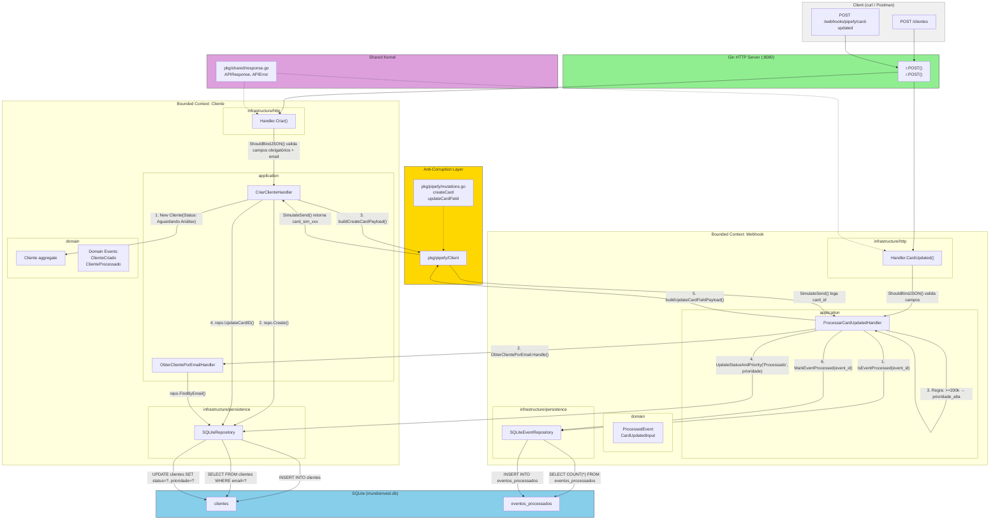

# Arquitetura Local

## Diagrama de Fluxo



## Camadas e Responsabilidades

| Camada | Responsabilidade | Exemplos de Arquivos |
|--------|-----------------|---------------------|
| `domain/` | Aggregate root, value objects, domain events, erros de domínio | `cliente.go`, `evento.go`, `errors.go` |
| `application/` | Commands (mutações) + Queries (leituras). Orquestra o fluxo, define ports | `commands.go`, `queries.go` |
| `infrastructure/http/` | Adapter HTTP — bind JSON, chama command, mapeia HTTP status | `handler.go` |
| `infrastructure/persistence/` | Adapter de banco — implementa a port definida em application | `repository.go` |
| `pkg/pipefy/` | Anti-corruption layer — mutations GraphQL, payload builder, simulação de envio | `client.go`, `mutations.go`, `models.go` |
| `pkg/shared/` | Shared kernel — formato de resposta padronizado da API | `response.go` |

## Fluxo de Dados — Criar Cliente

```
curl POST /clientes
  → Gin Router
    → HTTP Handler: ShouldBindJSON() → valida campos obrigatórios, email, valor>0
      → CriarClienteHandler.Handle()
        1. Constrói Cliente{Status: "Aguardando Análise"}
        2. repo.Create(cliente) → INSERT INTO clientes → retorna ID + created_at
        3. buildCreateCardPayload() → mutation createCard via pkg/pipefy
        4. pipefy.SimulateSend() → loga "card_sim_xxx" no console
        5. repo.UpdateCardID(email, cardID) → UPDATE clientes SET card_id=?
        Retorna Cliente completo com ID, CardID, Status
      → HTTP Handler: shared.Success(cliente) → 201 Created
```

## Fluxo de Dados — Webhook Card Updated

```
curl POST /webhooks/pipefy/card-updated
  → Gin Router
    → HTTP Handler: ShouldBindJSON() → valida event_id, card_id, email, timestamp
      → ProcessarCardUpdatedHandler.Handle()
        1. eventRepo.IsEventProcessed(event_id)
           → Se já processado → ErrEventAlreadyProcessed → 409 Conflict
        2. clienteQry.Handle(email) → repo.FindByEmail()
           → Se não encontrado → ErrClientNotFound → 404 Not Found
        3. Regra de prioridade:
           - valor_patrimonio >= 200000 → prioridade_alta
           - valor_patrimonio < 200000  → prioridade_normal
        4. clienteUpd.UpdateStatusAndPriority("Processado", prioridade)
           → UPDATE clientes SET status=?, prioridade=?
        5. buildUpdateCardFieldPayload(cardID, prioridade) → mutations updateCardField
        6. pipefy.SimulateSend() → loga no console
        7. eventRepo.MarkEventProcessed(event_id)
           → INSERT INTO eventos_processados
        Retorna nil (sucesso)
      → HTTP Handler: shared.Success({"message": "event processed successfully"}) → 200 OK
```
